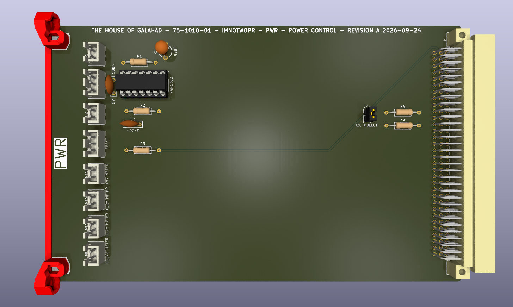

# PWR PCB

Power Control Module PCB

Status: Untested

The PWR module provides power control, status indication, and manual bus reset for the IMNOTWOPR computer. It switches the ATX power supply through the backplane power-on signal and uses separate LEDs to indicate standby power and PSU power-good status, automatically extinguishing the standby LED when main power is enabled. The board also provides connections for monitoring the +5 V, +12 V, −12 V, and +12 V2 rails with voltage meters, along with jumper-selectable I²C pull-ups.

The PWR module and the BACKPLANE both provide the option for I²C pull-ups for convenience.  Only on should be enabled at a time.

## Documents

- [Schematic](PWR_schematic.pdf)
- [Assembly](PWR_assembly.pdf)
- [Bill of Materials](bom.csv)
- [Interactive Bill of Materials](ibom.html)

## Gerber To Order

- [Default](gerber_to_order/PWR_160.0x100.0mm_for_Default.zip)
- [Elecrow](gerber_to_order/PWR_160.0x100.0mm_for_Elecrow.zip)
- [FusionPCB](gerber_to_order/PWR_160.0x100.0mm_for_FusionPCB.zip)
- [JLCPCB](gerber_to_order/PWR_160.0x100.0mm_for_JLCPCB.zip)
- [PCBWay](gerber_to_order/PWR_160.0x100.0mm_for_PCBWay.zip)

## Rendered Images

### Top 3D

### Top

### Bottom

