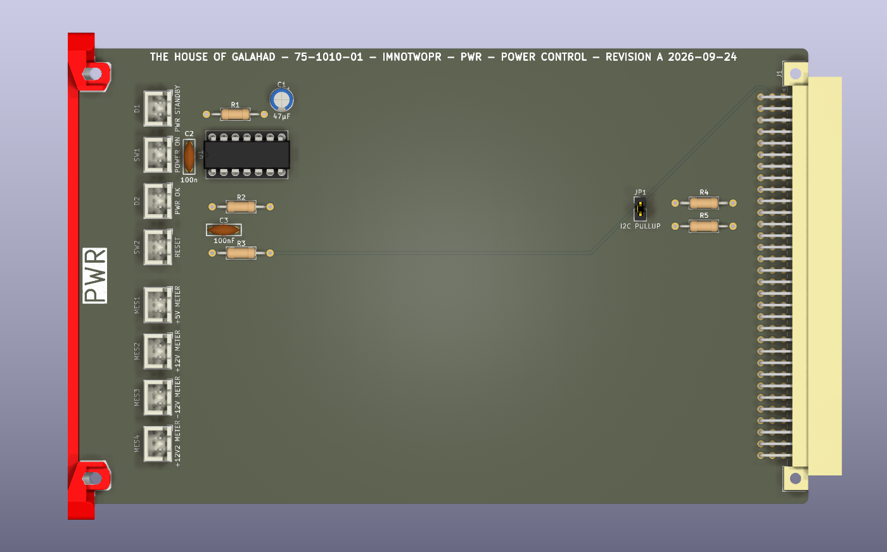
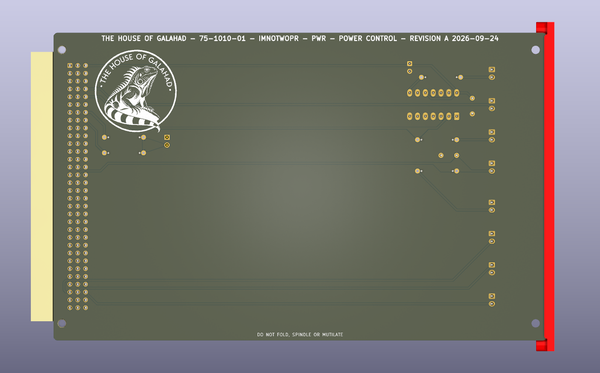

# PWR PCB

Power Control Module PCB

Status: Untested

The power control module serves 3 purposes:

- LED indicator to show the status of the PSU +5V standby power when the main power is **OFF**.
- LED indicator to show when main power is **ON**.
- Toggle switch to assert the **RESET** signal on the bus.

## Documents

- [Schematic](PWR_schematic.pdf)
- [Assembly](PWR_assembly.pdf)

## Gerber To Order

- [Default](gerber_to_order/PWR_160.0x100.0mm_for_Default.zip)
- [Elecrow](gerber_to_order/PWR_160.0x100.0mm_for_Elecrow.zip)
- [FusionPCB](gerber_to_order/PWR_160.0x100.0mm_for_FusionPCB.zip)
- [JLCPCB](gerber_to_order/PWR_160.0x100.0mm_for_JLCPCB.zip)
- [PCBWay](gerber_to_order/PWR_160.0x100.0mm_for_PCBWay.zip)

## Rendered Images

### Top

### Bottom

