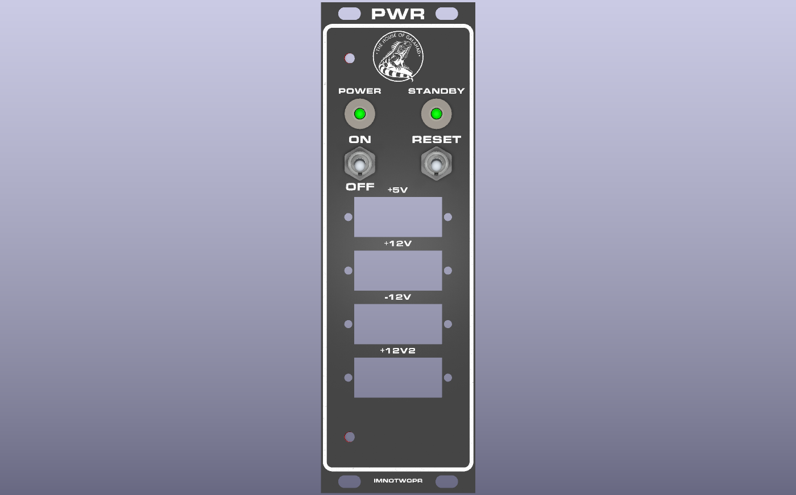
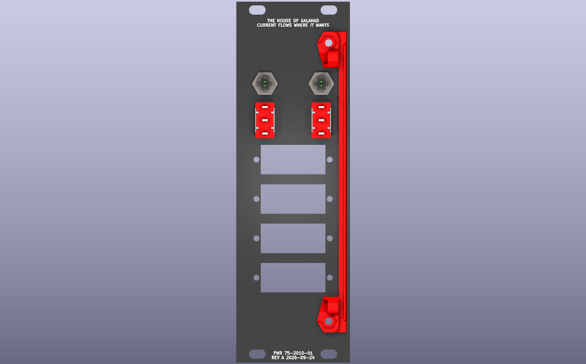

# PWR Panel

Power Control Module Panel

Status: Untested

The PWR panel uses a PCB as the physical front panel for the IMNOTWOPR power control module. It provides labeled openings for the power and reset switches, power and standby LEDs, and four voltage meters displaying the +5 V, +12 V, −12 V, and +12 V2 rails. Mounting holes secure the panel to the card bracket and chassis, bringing the module’s controls and indicators together in an accessible front-facing layout.

## Gerber To Order

- [Default](gerber_to_order/PWR_40.3x128.4mm_for_Default.zip)
- [Elecrow](gerber_to_order/PWR_40.3x128.4mm_for_Elecrow.zip)
- [FusionPCB](gerber_to_order/PWR_40.3x128.4mm_for_FusionPCB.zip)
- [JLCPCB](gerber_to_order/PWR_40.3x128.4mm_for_JLCPCB.zip)
- [PCBWay](gerber_to_order/PWR_40.3x128.4mm_for_PCBWay.zip)

## Rendered Images

### Front

### Back

