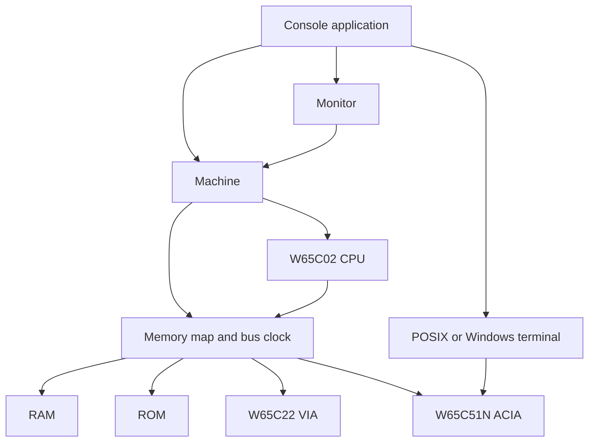

# Architecture and initial specification

Joshua is the hosted development companion to IMNOTWOPR. The hardware repository
intentionally does not define a mandatory memory map; Joshua follows that rule.
The initial processor has a 16-bit address space. Future 65816/banked systems are
not implied by the first implementation.

## Ownership

`Machine` composes the CPU, bus, device instances and execution breakpoints. The
CPU depends only on `Bus`, not the console, monitor, profile format or a particular
memory map. `Device` defines read, write, peek, reset, tick and IRQ behavior. A
RAM/ROM device is storage with a protection policy. The bus decoder has no built-in
IMNOTWOPR addresses. Mappings are immutable after machine construction in 0.1.

The public headers are under `include/joshua`; implementation is under `lib`.
`app/terminal.cpp` contains the platform-specific APIs. The core uses standard
C++23 and can be embedded in a different host application without console code.
No network service, compiler, external assembler or third-party CPU library runs
inside Joshua.

## Execution and time

`Cpu::step()` completes one instruction or interrupt entry. Each CPU read/write
calls the bus; the bus performs the access, advances one cycle, ticks every mapped
device, and optionally emits a `BusCycle` record. Dummy reads are real bus reads,
including their device side effects. Read-modify-write instructions use the CMOS
two-read/one-write sequence. Device time is never advanced in a lump after an
instruction.

Bus time is a monotonically increasing 64-bit cycle count. Reset takes seven bus
cycles and retains the elapsed counter. Power-on gives deterministic initial
register values; software must still initialize registers as it would on hardware.
Reset adjusts SP by three, sets I and clears D, and loads the reset vector.

The public stepping boundary is an instruction, not an individual PHI2 edge.
WAI advances peripherals while the CPU is waiting; STP stops CPU execution until
reset. IRQ is the logical OR of the mapped devices' IRQ state; NMI is explicitly
latched. The current interrupt decision is made at instruction boundaries.
This does not yet reproduce all interrupt sampling windows or external pin edges.

The host run loop handles terminal input, drains completed serial bytes, evaluates
execution breakpoints and optionally paces execution against `steady_clock`.
Host sleeps do not advance emulated time. Input is polled in bounded batches so a
large paste cannot starve execution. There is no background emulation thread;
paused inspection does not race CPU execution.

## Debugger semantics

`Bus::peek()` is a side-effect-free device view. `Bus::patch()` validates all
addresses before modifying RAM/ROM and does not tick devices. The monitor's load,
deposit and assembler use this path; save and disassembly use peek. Explicit
`io` commands use the normal read/write path. No implicit device write happens
when opening a memory view.

Instruction decoding, disassembly and ad-hoc assembly share one opcode table.
Breakpoints are host metadata, never BRK patches in the guest image. There are no
symbol files, read/write watchpoints, conditional breakpoints or snapshot files in
0.1; raw binary load/save operates only on memory bytes.

## Configuration decisions

- Initial machine: W65C02, VIA at `$8000`, ACIA at `$8010`, 32 KiB RAM and 16 KiB ROM.
- W65C51 means the current W65C51N behavior, including its transmit-empty quirk.
- CPU clock: 1 MHz by default. ACIA reference: 1.8432 MHz; default asserted DCD,
  DSR and CTS inputs represent a connected terminal.
- Input control: Ctrl-] enters the monitor. `run` resumes. The profile/CLI can
  change the escape byte; `send` can inject that byte into the guest.
- Config files use a strict, small `key = value` grammar and no dependency on
  TOML/JSON libraries. Unknown options and invalid maps fail before execution.
- Default number notation is monitor-style hexadecimal. Base prefixes are explicit.
- Unmapped reads return `$FF`; unmapped and ROM CPU writes are ignored.
- Map aliases, overlapping decode/bank switching and multiple VIA/ACIA instances
  are future extensions. Multiple distinct RAM and ROM regions already work.

## Next accuracy work

The immediate hardware work is to validate peripheral timing and interrupt entry
against captures from the actual IMNOTWOPR parts. VIA shift modes, port latching,
and CA/CB handshakes need a pin model. UART echo, break and modem-line transitions
need an explicit serial-line model. Unsupported configuration modes currently
raise an error so they cannot silently appear to work.

After that, introduce externally driven RDY/reset/NMI/IRQ lines and a resumable
single-cycle CPU interface for front-panel or bus-arbitration work. Keep these
changes below `Machine`; neither the monitor nor terminal should determine
processor timing.
