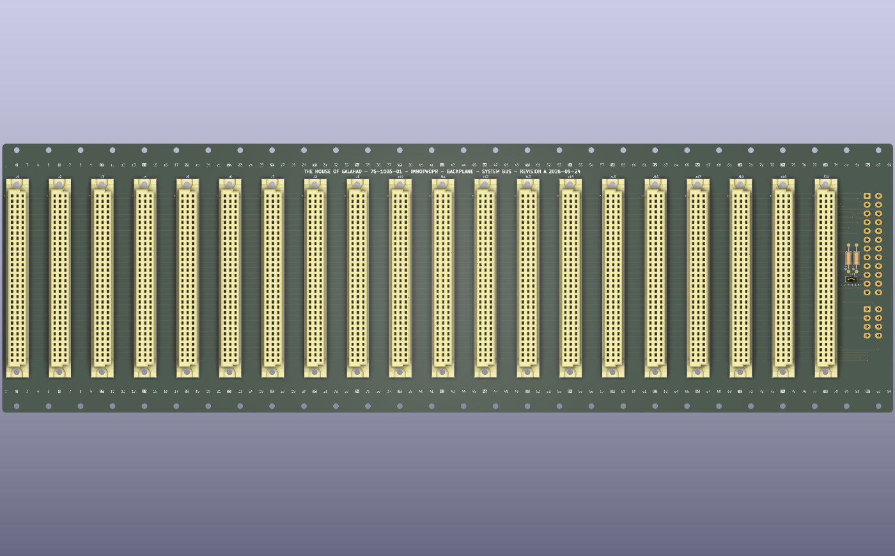
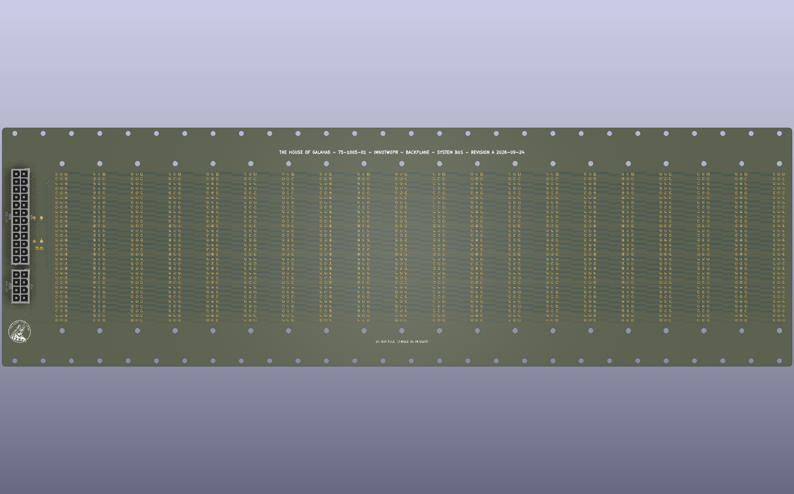

# BACKPLANE

System Bus

Status: Untested

The BACKPLANE PCB provides the shared bus and power distribution for the IMNOTWOPR modular computer, connecting CPU, memory, I/O, and front-panel cards through 20 96-pin DIN 41612 slots. It carries the 24-bit address bus, 8-bit data bus, clock and control signals, and auxiliary I²C and SPI interfaces. ATX power connectors supply the system power rails, with standby power and power-control signals available to the cards. The passive design also includes jumper-selectable I²C pull-ups.

## Documents

- [Schematic](BACKPLANE_schematic.pdf)
- [Assembly](BACKPLANE_assembly.pdf)
- [Bill of Materials](bom.csv)
- [Interactive Bill of Materials](ibom.html)

## Gerber To Order

- [Default](gerber_to_order/BACKPLANE_425.28x128.7mm_for_Default.zip)
- [Elecrow](gerber_to_order/BACKPLANE_425.28x128.7mm_for_Elecrow.zip)
- [FusionPCB](gerber_to_order/BACKPLANE_425.28x128.7mm_for_FusionPCB.zip)
- [JLCPCB](gerber_to_order/BACKPLANE_425.28x128.7mm_for_JLCPCB.zip)
- [PCBWay](gerber_to_order/BACKPLANE_425.28x128.7mm_for_PCBWay.zip)

## Rendered Images

### Top

### Bottom

